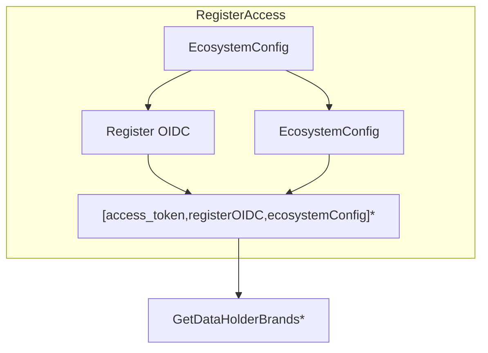

# Connectivity between ADR Gateway and ecosystem participants

## Data definitions

## EcosystemConfig

```ts
interface EcosystemConfig {
    dataRecipient: {
        registerId:string // the client_id supplied to us by the ACCC register
        applicationId: string // id of our application
    }
    clientCertificateSpec: {
        pfx: string, // location of the client certificate provided by the register
        passphrase: string
    }
    ourJWKS: JWKS.KeyStore // the keystore which will be used to sign requests to the register and Data Holders
    
}

```

## Endpoints

### `GET /brands`

This endpoint requires connecting to the register with the EcosystemConfig




This is expressed in the Neuron Extension parlance as follows:

```ts
const ecosystemConfig = EcosystemConfig();

const registerAccess = RegisterAccess(EcosystemConfig()).extend(GetAccessToken())

const dataholderBrands = GetDataHolderBrands(EcosystemConfig())

abstract class PathwaysFactory {

    EcosystemConfig: () => CompoundNeuron<void,EcosystemConfig>

    RegisterOidc: () => CompoundNeuron<void,RegisterOidcResponse>

    RegisterAccess: () => CompoundNeuron<void,RegisterAccessCredentials>

    GetDataHolderBrands: () => CompoundNeuron<void,DataholderBrand[]>

    GetDataHolderBrandStatus: (dataholderBrandId: string) => CompoundNeuron<void,DataholderBrandStatus>

}

@injectable
class DefaultPathwaysFactory extends PathwaysFactory {
    constructor(
        @inject("EcosystemConfig") private ecosystemConfig:EcosystemConfig
    ) {}

    EcosystemConfig = () => Neuron.ValueNeuron(this.ecosystemConfig)

    RegisterOidc = () => EcosystemConfig().Expand(new Neurons.RegisterOIDC())

    RegisterAccess = () => RegisterOidc().Expand(new Neurtons.RegisterAccessToken())

    GetDataHolderBrands = () => RegisterAccess().extend(new Neurons.GetDataholderBrands())

    GetDataHolderBrandStatus = (dataholderBrandId: string)
        => RegisterAccess(ecosystemConfig).extend(new Neurons.GetDataholderBrands())

}

namespace Neurons {
    class RegisterOIDC extends Neuron<EcosystemConfig,RegisterOidcResponse> {
        evaluate = (config:EcosystemConfig) => {

        }
    }

    class RegisterAccessToken extends Neuron<[EcosystemConfig,RegisterOidcResponse],RegisterAccessToken> {
        evaluate = ([config,oidc]:[EcosystemConfig,RegisterOidcResponse]) => {

        }
    }

    class GetDataholderBrands extends Neuron<[EcosystemConfig,RegisterOidcResponse,RegisterAccessToken],DataholderBrands> {
        evaluate = ([config,oidc]:[EcosystemConfig,RegisterOidcResponse]) => {
            // Extract config from EcosystemConfig
            // Extract the location of the api endpoint from RegisterOidcResponse
            // Extract the access token

            // Loop through all the data holders

            // Done
        }
    }

}


```